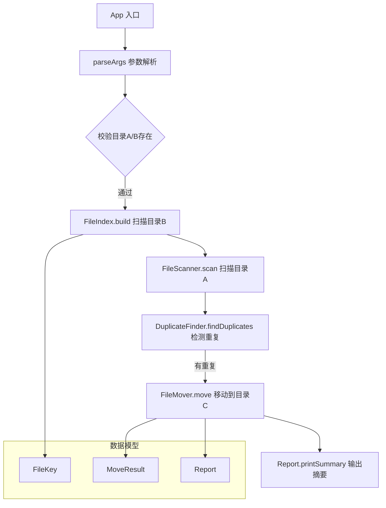

# 系统架构

## 概述

rmdup 是一个 Java 命令行工具，用于检测并移出目录间的重复文件。给定目录A（源目录）和目录B（参考目录），工具递归遍历两个目录的子目录层级，按文件名和文件大小匹配重复文件，将目录A中的重复文件移动到目录C，并保留原始相对路径结构。

目录B作为比对基准完全只读，目录C充当"回收站"，使操作可逆。工具适用于文件去重、磁盘空间整理、部署前清理等场景。

## 技术栈

**语言与运行时**
- Java 17 (OpenJDK)

**构建工具**
- Maven 3.8+
- maven-shade-plugin（打包为 fat JAR）

**依赖**
- 无外部运行时依赖，仅使用 Java 标准库（java.nio.file）

**测试**
- JUnit 5（可选，开发依赖）

## 项目结构

```
rmdup/
├── pom.xml                                      # Maven 构建配置
├── .gitignore                                   # Git 忽略规则
├── .monkeycode/                                 # 项目文档与规格
│   ├── docs/                                    # 项目文档
│   └── specs/
│       └── remove-duplicate-files/              # 特性规格
│           ├── requirements.md
│           ├── design.md
│           └── tasklist.md
└── src/
    ├── main/java/com/monkeycode/rmdup/
    │   ├── App.java                             # 入口类，参数解析与流程协调
    │   ├── FileKey.java                         # 文件键（文件名 + 大小）
    │   ├── MoveResult.java                      # 移动操作结果
    │   ├── Report.java                          # 执行报告
    │   ├── FileIndex.java                       # 目录B文件索引
    │   ├── FileScanner.java                     # 递归文件扫描器
    │   ├── DuplicateFinder.java                 # 重复检测器
    │   └── FileMover.java                       # 文件移动器
    └── test/java/com/monkeycode/rmdup/
        └── （测试代码目录）
```

**入口点**
- `src/main/java/com/monkeycode/rmdup/App.java` - 应用启动入口，`main()` 方法

## 子系统

### App（入口协调器）
**目的**：解析命令行参数，校验输入，协调各组件完成整体流程
**位置**：`src/main/java/com/monkeycode/rmdup/App.java`
**关键文件**：`App.java`
**依赖**：FileIndex、FileScanner、DuplicateFinder、FileMover、Report
**被依赖**：无（顶层入口）

### FileIndex（文件索引）
**目的**：遍历目录B建立文件索引，支持 O(1) 重复查询
**位置**：`src/main/java/com/monkeycode/rmdup/FileIndex.java`
**关键文件**：`FileIndex.java`
**依赖**：FileScanner、FileKey
**被依赖**：App、DuplicateFinder

### FileScanner（文件扫描器）
**目的**：递归遍历目录，返回所有普通文件路径列表，跳过符号链接和不可读文件
**位置**：`src/main/java/com/monkeycode/rmdup/FileScanner.java`
**关键文件**：`FileScanner.java`
**依赖**：无（仅标准库 java.nio.file）
**被依赖**：FileIndex、DuplicateFinder、App

### DuplicateFinder（重复检测器）
**目的**：遍历目录A，利用 FileIndex 识别重复文件
**位置**：`src/main/java/com/monkeycode/rmdup/DuplicateFinder.java`
**关键文件**：`DuplicateFinder.java`
**依赖**：FileScanner、FileIndex、FileKey
**被依赖**：App

### FileMover（文件移动器）
**目的**：将文件从目录A移动到目录C，保留相对路径结构
**位置**：`src/main/java/com/monkeycode/rmdup/FileMover.java`
**关键文件**：`FileMover.java`
**依赖**：MoveResult
**被依赖**：App

### Report（报告输出）
**目的**：收集和输出操作统计摘要
**位置**：`src/main/java/com/monkeycode/rmdup/Report.java`
**关键文件**：`Report.java`
**依赖**：MoveResult
**被依赖**：App

## 架构图



## 设计决策

1. **移动而非删除**：将重复文件从目录A移动到目录C，操作可逆，目录C充当回收站
2. **文件名+大小判定**：以文件名和文件大小作为重复判定标准，不计算哈希，性能更好
3. **零外部依赖**：仅使用 Java 标准库 java.nio.file，降低部署复杂度
4. **单文件失败不中断**：个别文件移动失败时记录错误继续处理，保证整体任务完成
