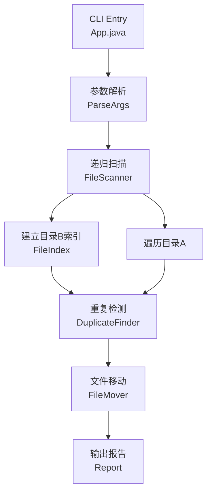

# 删除目录中重复文件

Feature Name: remove-duplicate-files
Updated: 2026-07-20

## Description

Java 命令行工具，接收三个目录路径作为参数（目录A、目录B、目录C），递归遍历目录B构建文件索引，递归遍历目录A查找重复文件（按文件名+文件大小匹配），将重复文件从目录A移动到目录C并保留相对路径结构。

## Architecture



## Components and Interfaces

### 1. App（入口类）

所在包：`com.monkeycode.rmdup`

- `main(String[] args)`：解析命令行参数，协调各组件完成整体流程
- 参数格式：`java -jar rmdup.jar <目录A> <目录B> <目录C>`

### 2. FileIndex（文件索引）

用于缓存目录B中所有文件的信息，以支持高效率查找。

```
Map<FileKey, Path> index
```

- `FileKey` 是一个不可变键，包含 `fileName: String` 和 `fileSize: long`
- `equals()` 和 `hashCode()` 基于两者实现
- `build(Path directoryB)`：递归遍历目录B，将所有文件按 FileKey 建立索引
- `boolean contains(FileKey key)`：检查某文件名+大小是否在目录B中存在

### 3. FileScanner（文件扫描器）

递归遍历指定目录，为每个普通文件返回路径和文件属性。

- `List<Path> scan(Path directory)`：递归返回目录下所有普通文件的路径列表
- 跳过目录和符号链接
- 对无法访问的路径记录警告并跳过

### 4. DuplicateFinder（重复检测器）

对比目录A中的文件与目录B的索引，找出重复文件。

- `List<Path> findDuplicates(Path directoryA, FileIndex indexB)`：遍历目录A，使用 FileIndex 判定重复
- 返回目录A中所有重复文件的路径列表

### 5. FileMover（文件移动器）

将文件从目录A移动到目录C，保留相对路径结构。

- `MoveResult move(Path sourceFile, Path baseA, Path baseC)`：
  1. 计算 sourceFile 相对于 baseA 的相对路径
  2. 在 baseC 下创建对应的父目录
  3. 使用 `Files.move()` 执行原子移动
- 返回 `MoveResult` 记录成功或失败详情

### 6. Report（报告输出）

- `void addMoved(Path from, Path to)`：记录成功移动
- `void addFailed(Path file, String reason)`：记录移动失败
- `void addScanned(int count)`：设置扫描文件总数
- `void printSummary()`：输出最终汇总信息

## Data Models

### FileKey

```java
public record FileKey(String fileName, long fileSize) {}
```

- 不可变数据类
- 作为 FileIndex 的键

### MoveResult

```java
public sealed interface MoveResult {
    record Success(Path source, Path destination) implements MoveResult {}
    record Failure(Path source, String reason) implements MoveResult {}
}
```

### Report

```java
public class Report {
    private int totalScanned;
    private final List<MoveResult.Success> moved = new ArrayList<>();
    private final List<MoveResult.Failure> failed = new ArrayList<>();
}
```

## Algorithm Flow

1. 解析命令行参数，获取 `pathA`、`pathB`、`pathC`
2. 校验 `pathA` 和 `pathB` 存在性
3. 若 `pathC` 不存在，创建 `pathC`
4. 递归扫描 `pathB`，为每个文件构建 `FileKey(name, size)`，存入 `FileIndex`
5. 递归扫描 `pathA`，对每个文件：
   a. 构建 `FileKey(name, size)`
   b. 查询 `FileIndex.contains(key)`
   c. 若命中，计算相对路径，在 `pathC` 下创建父目录，执行 `Files.move()`
   d. 记录结果到 `Report`
6. 输出 `Report` 摘要
7. 返回退出码（全部成功 0，有错误 1）

## Correctness Properties

- **目录B不变性**：程序在任何情况下不得修改目录B下的任何文件
- **目录A完整性**：非重复文件在目录A中保持不变
- **路径安全性**：目录C创建在用户指定的路径下，文件移动保留原始相对路径
- **原子移动**：使用 `Files.move()` 标准 API，同一文件系统内移动为原子操作
- **幂等性**：重复执行工具不会重复移动文件（因为文件已从目录A移出）

## Error Handling

| 场景 | 处理策略 |
|------|---------|
| 参数不足或格式错误 | 输出用法说明，退出码 1 |
| 目录A或B不存在 | 输出错误信息，退出码 1 |
| 目录C创建失败 | 输出错误信息，退出码 1 |
| 遍历过程中文件不可读 | 记录警告，跳过该文件，继续处理 |
| 移动操作失败（权限/磁盘满等） | 记录错误，继续处理剩余文件 |
| 目标文件已存在 | 记录错误，跳过该文件 |

## Test Strategy

- **单元测试**（JUnit 5）：FileIndex、FileScanner、DuplicateFinder、FileMover 各组件独立测试
- **集成测试**：使用临时目录构建测试场景，验证完整流程
- **测试场景**：
  1. 空目录A或空目录B
  2. 文件完全重复
  3. 同名不同大小的文件不匹配
  4. 同大小不同名的文件不匹配
  5. 多层嵌套子目录
  6. 目录A和B有重叠部分重复
  7. 权限不足的文件跳过处理
  8. 目录C已存在时的行为

## Build Configuration

- Java 17（LTS）
- Maven 构建，不依赖任何外部库
- 打包为可执行 JAR（`maven-jar-plugin` + `maven-shade-plugin`）
